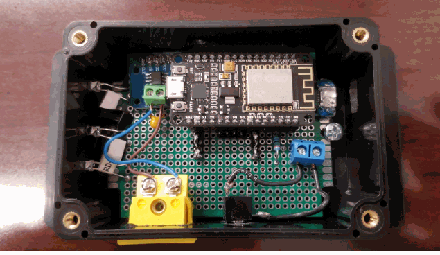
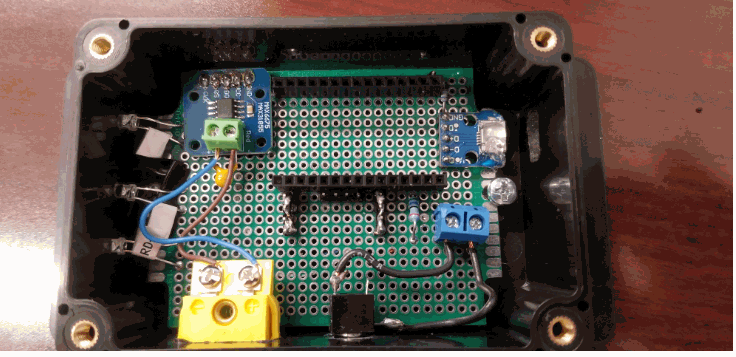
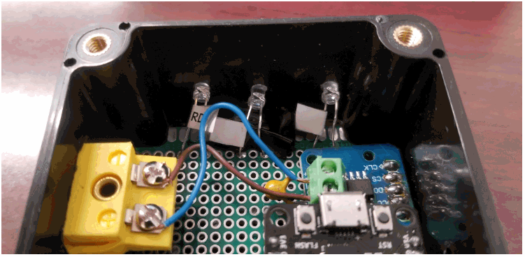
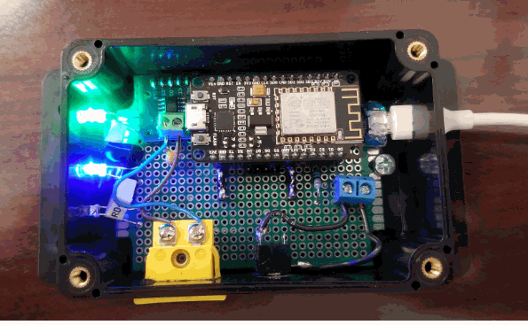
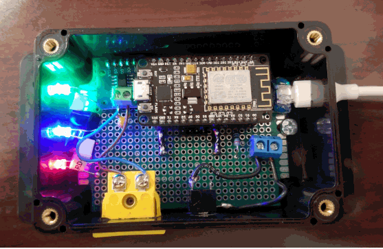
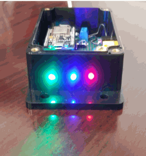

# smoker-sensor

I created a sensor that will read both the temperature of a smoker box and a single probe for food temperature.

It provides a webpage to display the current temperatures (updates every 10 seconds) along with communication to an MQTT broker for 
accessing the temperatures for my home automation system (Home Assistant).

It's built around a NodeMCU development board because it is lower power and provides wifi on board. It is programmmed using the Arduino-IDE.

The Arduino skecth is included here along with a schematic developed using the Fritzing app.

Here is the parts list:

| Part | Link |
| --- | --- |
| NodeMCU | https://smile.amazon.com/gp/product/B07L8W9SP3 |
| Thermocouple probe | https://smile.amazon.com/gp/product/B07JL1SN7X |
| MAX31855 breakout board for thermocouple | https://smile.amazon.com/gp/product/B07T7WY3H8 |
| panel mount thermocouple connector | https://smile.amazon.com/k-type-thermocouple-miniature-socket-connector/dp/B071SCMHRX |
| thermocouple male connector | https://smile.amazon.com/Twidec-Thermocouple-Connector-Adapter-Temperature/dp/B07PQW47BP |
| thermister probe | https://smile.amazon.com/gp/product/B07L4TQC4B |
| Thermister connector | https://smile.amazon.com/gp/product/B01ASF0GWS |
| LED's | https://smile.amazon.com/gp/product/B01AUI4W5U |
| waterproof box | https://smile.amazon.com/gp/product/B07QGS2HT4 |
| USB Power connectors | https://smile.amazon.com/gp/product/B0183KF7TM |
| capacitors | https://smile.amazon.com/gp/product/B07KRTQGL7 |
| USB extension plug | https://smile.amazon.com/gp/product/B00B5HSC20 |
| perf board | https://smile.amazon.com/gp/product/B07QL77SC5 |
| resistors | https://smile.amazon.com/gp/product/B072BL2VX1 |

You can likely get all of this cheaper on sites like Aliexpress with the attendant longer shipping times.

The sensor serves up a webpage to allow you to see the current temperatues in real time (it updates every 10 seconds) and an MQTT connection to allow you to connect to your home automation system.

I have provided two different Arduino Sketches. One that provides the MQTT connection and one that doesn't. So if you don't have the need to use MQTT then use the latter (non-MQTT) sketch.

Initial config is done via an AP (SmokerConnectAP) provided by the NodeMCU. Once connected to the AP then navigate 192.168.1.4 and fill in your credentials.

After the initial config is completed then the sensor will reboot and connect to your wifi network (and MQTT broker if used). You will need to go into your router to find the IP address of the sensor or however you normally find IP addresses of devices on your network.

The sensor has three status LED's - One for Power (green), One for Wifi connection status (blue) and an activity LED (red)

Here is the schematic:

Here are the pictures of the end result:

